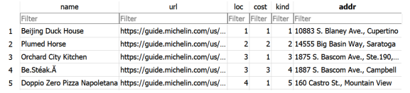
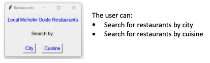
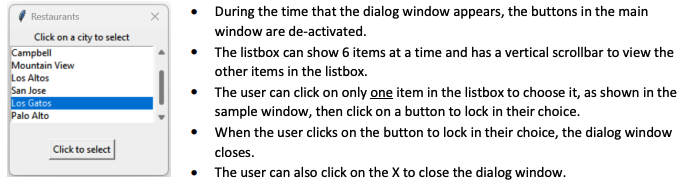
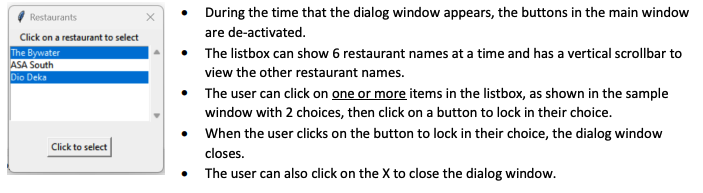
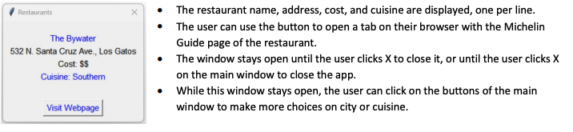

# CIS 41B - Lab 3
## Web scraping and data storage with requests, beautifulsoup, sqlite3, and review of tkinter

To help CIS 41B students celebrate their victory over CIS 41B topics at the end of June, write an app that lets CIS 41B students (and anyone else) choose a restaurant for their celebratory dinner from the list of local Micheline Guide restaurants.

## Overview
The application has 2 parts: 
1. lab3back.py (the backend to get data) and  
2. lab3front.py (the frontend with the GUI)  

The 2 parts do not work directly with each other (no importing of data or calling methods from the other file).
Instead: 
- the lab3back.py will produce a JSON file and an SQL database file
- the lab3front.py will read from the SQL database to display data to the user
  
lab3back.py
This module has 2 distinct parts: A and B. 
**After you finish writing part A, you comment out part A and write part B.**
Only one part will run at a time.

Here's a diagram: 
webpage ===> Part A ===> JSON file  
JSON file ===> Part B ===> SQL Database  

---
## Part A
### Step 1: 
The code will start by scraping data from the Michelin Guide page for restaurants in San Jose:
https://guide.michelin.com/us/en/california/san-jose/restaurants

From the URL above, use requests and beautifulsoup to extract the following information for each restaurant on the page:
• URL of the restaurant
• Name of the restaurant
• Location or city name (such as San Jose or Los Gatos)
• Cost (number of $ signs)
• Cuisine (Mexican or French)

Then, use the URL of the restaurant to do a web crawl to the restaurant page and extract the following information:
• Address of the restaurant (street address and city)
• Alternatively, the cost and cuisine can be extracted from this page instead of the previous page.

It’s up to you how to organize the web scraping code. You can use OOP, or several functions or one block of code in main. 
While testing and debugging your code, use ‘ascii’ encoding so that you can print the text to debug. 
But after you’ve got the code working, use ‘utf8’ encoding so that you can keep the Unicode characters in the data.

### Step 2: 
From the extracted data, create a JSON file to store the data.
It's up to you how to organize the data in the JSON file, the goal is to make it easy to read the data back out.
For example, **storing all the data of all the restaurants in a 1D list is probably not a good idea.**

### Step 3: 
After you’ve created a JSON file with the data of San Jose restaurants, make the web scraping code more robust by running it to scrape data from the Michelin Guide page for restaurants in Cupertino:
https://guide.michelin.com/us/en/california/cupertino/restaurants

*Your code should be able to run without error and produce a JSON file for the first page of the Cupertino restaurants.
The only extra work you need to do is analyze the HTML code and see how you can add code to go to the second page (or any number of subsequent pages) to get data from the restaurants on the second page.*

---
## Part B
After you've created both JSON files, you don't need to spend time fetching data from the website anymore, and you can comment out the code. You might have noticed that it takes a couple seconds to run the web scraping code, so it is a
good idea to store the data locally instead of fetching it from the URL each time.

### Step 1: 
Read data from the JSON file into the SQLite database.

The database has 4 tables:
- a table to store unique locations or city names
- a table to store unique costs or $ signs
- a table to store unique cuisine names
- a main table to store all 6 attributes of the restaurants: name, URL, location, cost, cuisine, addresswhere the location, cost, cuisine are foreign keys to index the first 3 tables.

Here’s an example of the first 5 rows of the main table for Cupertino restaurants, as viewed with the DB Browser app:

lab3front.py
Interaction with the user through GUI windows
All windows below are samples only, feel free to use your own wording and font type / size / color for your windows.
1. Write a GUI with 3 window classes: main window, dialog window, display window.
2. The app starts with a main window that has text to explain the application and 2 buttons.

3. When the user clicks on a button, a dialog window appears with a listbox of cities or cuisines.

4. After the dialog window closes, if the user made a choice of city or cuisine, the main window creates a dialog
window with a list of restaurant names that are in the chosen city or specialize in the chosen cuisine.

5. After the dialog window closes, if the user made at least one restaurant choice, then for each of the chosen restaurants, the main window creates a display window.

6. In addition to the 3 window classes, there is also a pop up messagebox that prints an error message if the database
file can’t be opened successfully. The app ends when the user clicks to acknowledge this messagebox.

### Interaction with the SQL database
1. All restaurant data must come from querying the database.
- Do not access the JSON file.
- Do not read all data from the database into a Python data structure in memory. **Only query and fetch what you need.**
2. Connect to the database and keep the connection open during the entire run time of the application. Don’t keep closing and opening the connection to the database. Don’t forget to close the database when done.

Documentation reminders:

• Your name and a short description of the code at the top of each source file.
• A docstring for each public method in the lab3front.py

When done, turn in 5 files: 
1. lab3front.py 
2. lab3back.py, 
3. the DB file for Cupertino restaurants, 
4. 5. the 2 JSON files (one for San Jose, one for Cupertino)